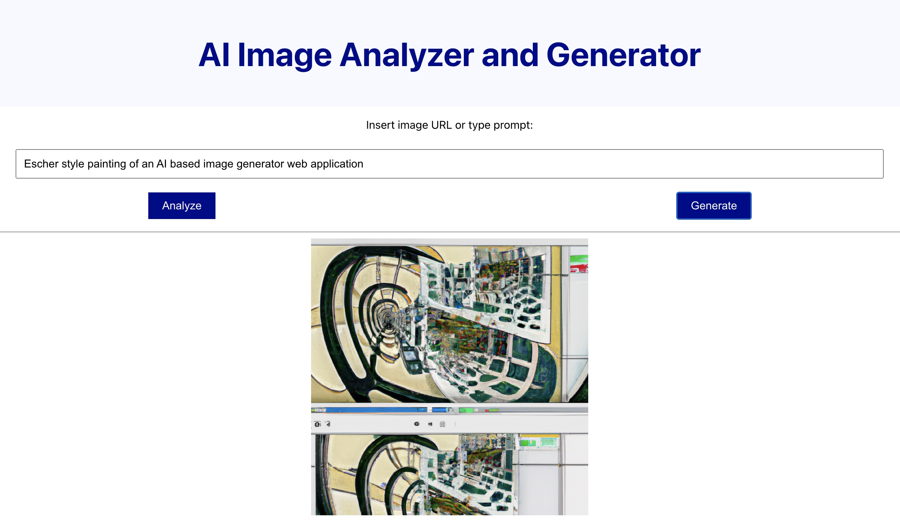

# Introduction
This project is used as an educational material to teach and demonstrate in practice the following topics:

- How to cover the full software development lifecycle in a cloud including deployment of the final product.
- What GitHub offers for achieving the above objective (Git repository, Codespaces, Actions, etc.).
- The benefits of using an AI pair programming technique with GitHub Copilot.
- What is a mashup (a.k.a. application hybrid) and ways to leverage myriad of freely available services in a cloud.
- Basics of the following technologies:
    - React based web application in JavaScript
    - Azure Static Web Apps service
    - Azure Computer Vision service (to describe an image given by its URL)
    - Public OpenAI service (to generate an image based upon a description)
- How to utilize [GitHub Dependabot](https://github.com/skills/secure-repository-supply-chain) to receive notifications and pull requests regarding version updates and vulnerabilities. 
- How to properly manage secrets in an application.
- The importance of properly separating UI styles from rest of the application logic.
- The different ways to communicate with remote services (SDKs, RESTful API calls, etc.).
- The usage of [slidev](https://sli.dev/) to produce presentations in developer friendly manner and how to publish it as a static website via [GitHub Pages](https://pages.github.com/).

# Usage
The user interface is rudimentary to keep things simple. The *Analyze* button will show an image and a JSON formatted
description of that image as received from the Azure Computer Vision service. The *Generate* button will produce an
image based upon the given prompt using the public OpenAI service (see the screenshot below). If the application detects that not all secrets were provided as environment variables, then it will simply print a short message at the screen. A new version will need to be deployed having all these secrets specified.

<kbd></kbd>

> Observe that hitting the *Generate* button in succession will produce different responses. This is because the OpenAI service is not deterministic.

# Development
This application can be further developed and run either using GitHub Codespaces or using a local IDE and pushing
changes back into the repo. Any change in the `main` branch triggers a GitHub Action to execute a workflow for deploying a new
application using the Azure Static Web Apps service. This process expects a set of secrets,
as described below (see also the [devcontainer.json](.devcontainer/devcontainer.json) file).

## Codespaces 

Wait until the container is fully setup; the last step installs dependencies as specified in the package descriptor. The application should be started from the Terminal window by summoning `npm start`.

> Codespaces leverages the [development containers](https://containers.dev) open standard as a way to boost containers with development related content and settings.  

## Continuous Deployment
First, a new Azure static web application resource must be created, using the Azure Portal or CLI, and its deployment token copied. The [GitHub workflow file](https://github.com/evarga/ai-imager/blob/main/.github/workflows/azure-static-web-apps.yml) should serve as a guidance what [repository secrets](https://docs.github.com/en/actions/security-guides/using-secrets-in-github-actions#creating-secrets-for-a-repository) must be created (see the `env:` section) including the previously mentioned deployment token (see `AI_IMAGER_DEPLOYMENT_TOKEN`).

Once the above preconditions are met the system is ready to automatically deploy a new version of this application in Azure. This will happen, for example, on every push into this repository.

# Security Concerns
This application is far from ready to be given to users. There are numerous security aspects that must be tackled. Namely, we are directly assigning the URL entered by a user to the `` attribute. This creates the following vulnerabilities:

- *Path traversal*: This is a type of attack that allows an attacker to access files and directories that are outside the web root folder by manipulating the file paths in the requests.
- *Cross-site scripting (XSS)*: This is a type of attack that allows an attacker to inject malicious code into a web page by using an image tag. This may arise in situations when the image is dynamically parsed and rendered, like SVG.
- *Cross-site request forgery (CSRF)*: This is a type of attack that allows an attacker to perform unauthorized actions on behalf of a user by using an image tag. For example, they may spawn an HTTP GET request to any remote site.
- *Information disclosure*: This is a type of attack that allows an attacker to obtain information about the user or the website by using an image tag. It is tightly related to the previous item. 

## Some Best Practices that should be Applied
All user inputs must be sanitized, in this case the image URL. It is advisable to apply the [Content Security Policy](https://developer.mozilla.org/en-US/docs/Web/HTTP/CSP) standard to mitigate many previously mentioned issues. Also, consult [SameSite cookies](https://web.dev/articles/samesite-cookies-explained) to prevent CSRF attacks.

# Conclusion
With the help of AI it is possible to craft interesting mashups that were unimaginable not so long time ago. This project showcases the abilities of OpenAI to understand, describe and synthetize images and potentially do language translations on-the-fly. This project also illustrates many technical details that are common in architecting distributed systems, as well as, the best industry pactices, like CI/CD pipelines to automate SDLC related tasks.
