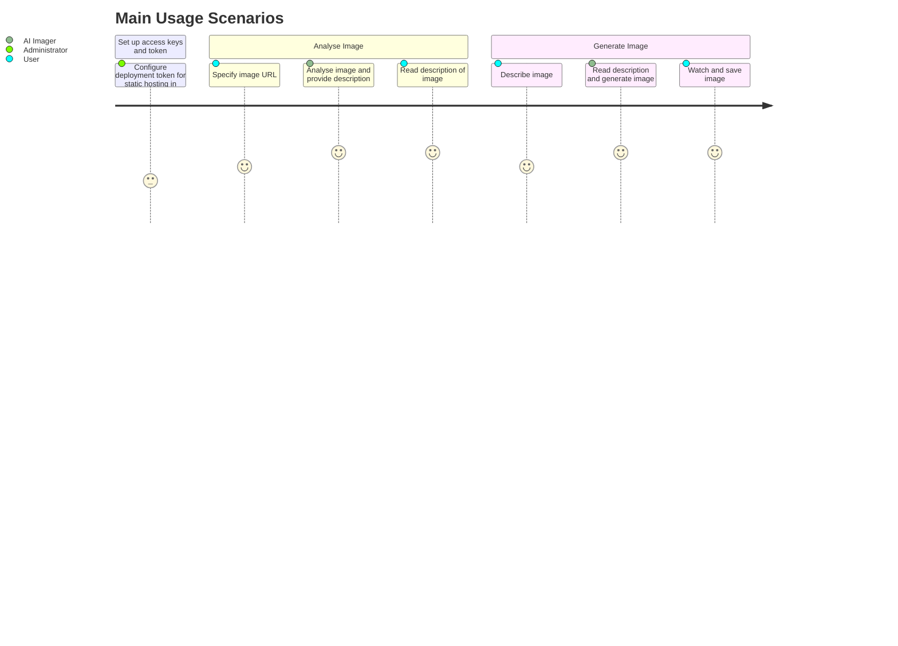
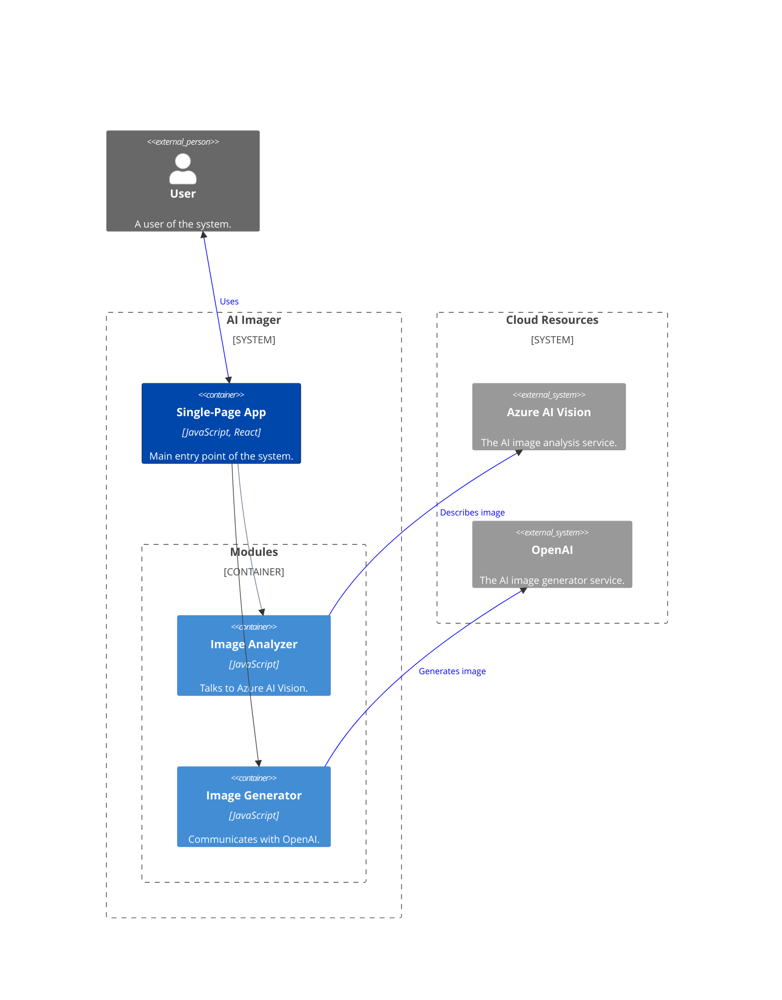

  
    Press Space for next page <carbon:arrow-right class="inline"/>
  

  <a href="https://github.com/evarga/ai-imager" target="_blank" alt="GitHub" title="Open in GitHub"
    class="text-xl slidev-icon-btn opacity-50 !border-none !hover:text-white shadow-icon">
    <carbon-logo-github />
  </a>

---

# Navigation

Hover in the bottom-left corner to see the navigation's controls panel, [learn more](https://sli.dev/guide/navigation.html).

## Keyboard Shortcuts

|     |     |
| --- | --- |
| <kbd>right</kbd> / <kbd>space</kbd>| next animation or slide |
| <kbd>left</kbd>  / <kbd>shift</kbd><kbd>space</kbd> | previous animation or slide |
| <kbd>up</kbd> | previous slide |
| <kbd>down</kbd> | next slide |

Hover over here!

---
hideInToc: true
---

# Table of Contents

<Toc minDepth="1" maxDepth="2"></Toc>

---

# Use Cases

Use cases are important in scoping a product and understanding the behavioral requirements, through which a user achieves their
goals by using a system. Use cases can be visualized in many ways, via UML use case diagrams, user journeys, etc. A [user journey diagram](https://mermaid.js.org/syntax/userJourney.html) depicts various actors taking actions in use cases. This helps figure out who is doing what and when to complete each usage scenario.

A use case (or user journey) diagram is not a formal decription of use cases or requirements of a system. These must be separately handled and specified.

---
layout: center
---

---
layout: section
---

# Architecture and Design

---

## What is a Mashup?

A *mashup* is a computer industry jargon that denotes a hybrid web application capable of combining data and services from various sources. This project is an example of a so-called *consumer mashup*, since it provides a new aggregated service on top of external ones, which are enrolled below:

- [Azure AI Vision Image Analysis](https://learn.microsoft.com/en-us/azure/ai-services/computer-vision/overview-image-analysis?tabs=4-0)
- [OpenAI](https://openai.com)

Auxiliary cloud services that help implement the web application (including deployment and monitoring) are not considered part of a mashup, since these are not directly perciveable by end users nor deliver functionalities to address major uses cases. For example, this project uses [Azure Static Web Apps](https://learn.microsoft.com/en-us/azure/static-web-apps/overview) service for deployment, although it is not counting toward being part of a mashup.

---
transition: fade-out
---

## Visualizing a Software Architecture

<v-clicks>

- The [C4 model](https://c4model.com) is superb for visualizing software architecture. There are several diagram types each with various abstraction levels. This project combines the [system context diagram](https://c4model.com/#SystemContextDiagram) and the [container diagram](https://c4model.com/#ContainerDiagram) into something that could be called as *expanded system context* diagram. It shows both the system boundary and major constituent parts of the web application. The main advantages of C4 are its flexibility and informal treatment of diagrams, which allows omitting details not relevant for understanding the content.

- A crucial aspect of any visualization system is to keep diagram specifications inside the same version control system where the rest of source code lives. Placing diagrams near code ensures that they will stay in sync with a target system. Furthermore, working with textual diagram files is a more developer friendly experience and allows all sorts of automations. For example, it is possible to transform textual representations into many target formats. This project uses [Mermaid](https://mermaid.js.org) for this purpose.= 2">*

- Another advantage of keeping diagrams in textual format is adherence to the [seperation of concerns](https://en.wikipedia.org/wiki/Separation_of_concerns) principle. There is no need to worry about nuances of visual rendering while focusing on essential elements of a diagram (like, what entities to show, how they are related, etc.). Isolating these aspects makes it easy to apply various themes and styles to change the final appereance.

</v-clicks>

= 2" class="mt-5 text-sm opacity-75">
  * There are other tools of this sort, but Mermaid is well integrated into Slidev.

---
layout: center
---

---
layout: section
---

# Implementation

---

## Image Analysis Module

<<< @/snippets/azure-image-analysis.js js {none|1-2|4-5|7-10|12-14|16-22|all}
<arrow v-click="[5, 6]" x1="500" y1="300" x2="620" y2="360" color="#953" width="2" arrowSize="1" />

---

## Image Generation Module

<<< @/snippets/openai-image-generation.js#presentation js {none|1|3-5|7-21|all}

---
layout: end
hideInToc: true
---

## <CheckeredFlag/> THE END <CheckeredFlag/>

**In Summary:**
This unit has explored the benefits of combining external distributed services to deliver a new functionality. It has showcased the power of AI in handling vision and imaging tasks. Key implementation details were revealed that have illuminated two ways to communicate with remote systems: using a generic HTTPS protocol and relying on client SDK. Finally, some aspects of visualizing a software architecture were also discussed. 

**Thank You:**
If you find this project useful, please consider giving it a star on GitHub! Just visit [AI Imager](https://github.com/evarga/ai-imager) and click on the ⭐ button in the top-right corner to show your support. Your stars make a big difference!
